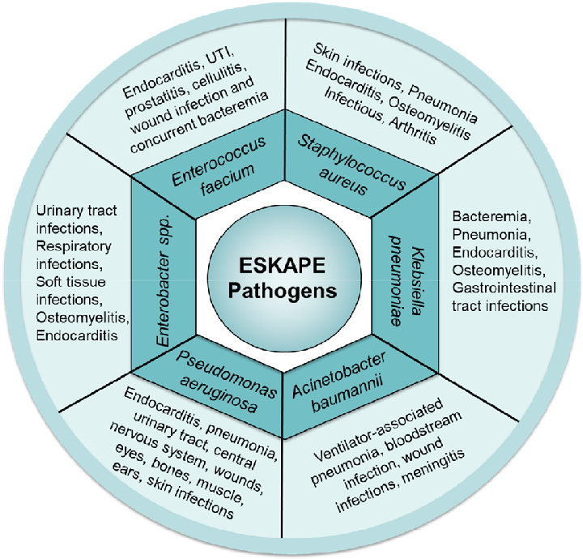

# ESKAPE Pathogens

Nocosomial infections are caused by a variety of organisms, and can be derived from both exogenous and endogenous sources and are transferred by either direct or indirect contact. Growing numbers of antimicrobial-resistant pathogens are increasingly associated with nocosomial infections. Recent reports from hospital-based surveillance studies have begun to refer to a group of nocosomial pathogens as ESKAPE pathogens. These are a group of bacteria, including both gram-positive and gram-negative species, made of the following six bacterial species:
* _Staphylococcus aureus_
* _Enterococcus faecium_
* _Klebsiella pneumoniae_
* _Acinetobacter baumannii_
* _Pseudomonas aeruginosa_
* _Enterobacter species_

 

These pathogens are associated with the highest risk of death, resulting in higher healthcare costs. Multiple alternative therapies are being trialed and in practice include the use of antibiotics in combination or with adjuvants, bacteriophage therapy, antibacterial antibodies, phytochemicals, and nanoparticles as antibacterial agents. However, there remains an insufficiency of effective antibiotic combinations, in addition to the dry pipeline of new drugs. A uniform research methodology used to test the efficacy of these therapeutic agents, well-defined standards and well-performed clinical trials can aid in understanding the therapeutical potential of these agents.

## Sources
1. [Mechanisms of Antimicrobial Resistance in ESKAPE Pathogens](https://pubmed.ncbi.nlm.nih.gov/27274985/)
2. [Advances in Nanotechnology for Biofilm Inhibition
](https://pubmed.ncbi.nlm.nih.gov/37360468/)
3. [Emerging Strategies to Combat ESKAPE Pathogens in the Era of Antimicrobial Resistance: A Review
](https://www.frontiersin.org/journals/microbiology/articles/10.3389/fmicb.2019.00539/full)