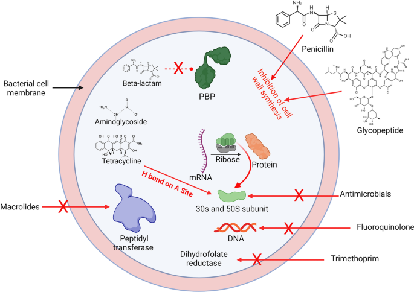

# _Staphylococcus aureus_: Biology and Resistance Mechanisms

_Staphylococcus aureus_ is a Gram-positive catalase-positive coccus that commonly colonizes human skin and mucous membranes, but is also a major opportunistic pathogen responsible for a wide spectrum of diseases, from superficial skin infections to severe systemic diseases such as bacteremia, pneumonia, and endocarditis.

Its success as both a commensal and a pathogen is attributed to its adaptability and the arsenal of virulence factors it produces, including surface proteins that mediate adhesion, enzymes that facilitate tissue invasion, and toxins that damage host cells and modulate immune responses.

The regulation of virulence in _S. aureus_ is complex and involves several global regulatory systems, notably the accessory gene regulator (agr) quorum sensing system, which controls the expression of many toxins and exoenzymes in response to cell density. Additional regulatory systems, such as SarA and Rot, further fine-tune the expression of virulence determinants, enabling the bacterium to adapt to changing host environments
and evade immune defenses. 

_S. aureus_ has developed multiple mechanisms of antibiotic resistance, most notably the production of β-lactamases that inactivate penicillins and the acquisition of the mecA gene, which encodes an altered penicillin binding protein (PBP2a) with low affinity for β-lactam antibiotics, resulting in methicillin resistance (MRSA). Resistance is further enhanced by biofilm formation, which protects bacterial communities from both antibiotics and immune attacks, and by the horizontal transfer of resistance genes via mobile genetic elements, making _S. aureus_ a persistent and evolving threat to public health. 

## Sources: 
1. [_Staphylococcus aureus_: A Review of the Pathogenesis and Virulence Mechanisms
](https://pubmed.ncbi.nlm.nih.gov/40426537/)
2. [Pathogenicity and virulence of _Staphylococcus aureus_
](https://pubmed.ncbi.nlm.nih.gov/33522395/)
3. [_Staphylococcus aureus_: Current perspectives on molecular pathogenesis and virulence
](https://pubmed.ncbi.nlm.nih.gov/39758277/)