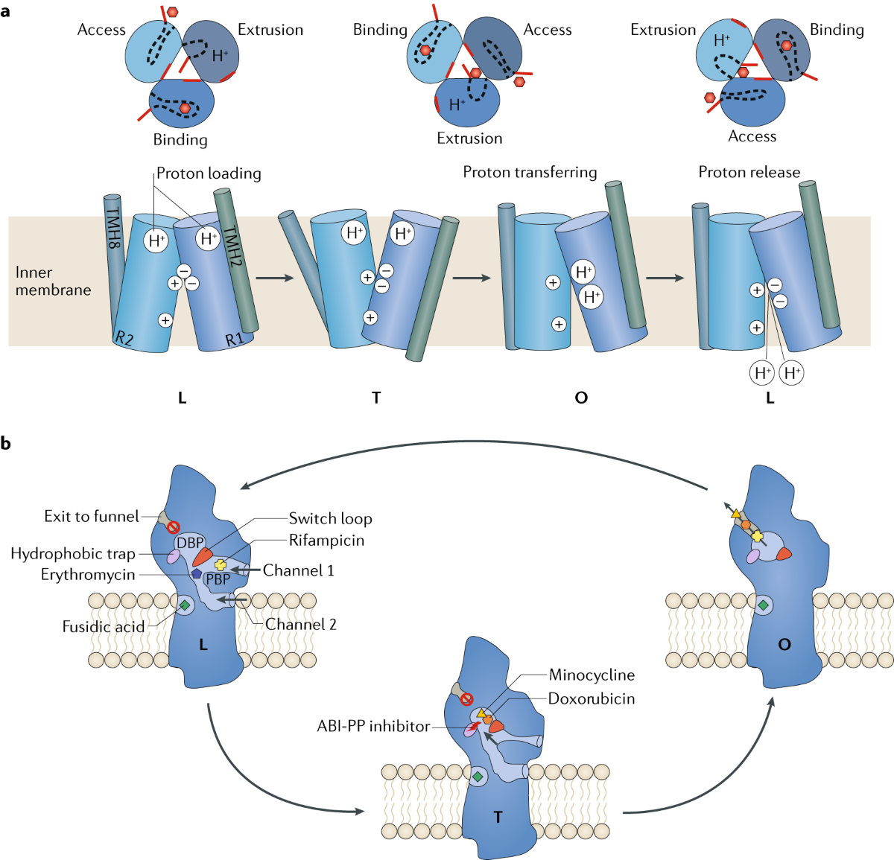

# Multidrug Resistance and the Role of Efflux Pumps

Multidrug resistance (MDR) in bacteria is a growing global health threat, largely driven by the action of efflux pumps—membrane-bound transport proteins that actively expel a wide variety of antibiotics and toxic compounds from the cell, thereby reducing intracellular drug concentrations to sub-lethal levels. Efflux pumps are found in both Gram-positive and Gram-negative bacteria and play a crucial role in intrinsic and acquired resistance by exporting structurally diverse antimicrobial agents, detergents, dyes, and even heavy metals. These systems are classified into several major families, including the ATP-binding cassette (ABC) superfamily, major facilitator superfamily (MFS), multidrug and toxic compound extrusion (MATE) family, resistance-nodulation-division (RND) family, small multidrug resistance (SMR) family, and the proteobacterial antimicrobial compound efflux (PACE) family, each differing in structure, energy source, and substrate specificity.

Efflux pumps not only contribute to antibiotic resistance but also play broader physiological roles in bacterial survival, such as the extrusion of metabolic waste products, signaling molecules involved in quorum sensing, and factors necessary for biofilm formation and virulence. The RND family, for instance, is particularly important in Gram-negative bacteria like Pseudomonas aeruginosa, where pumps such as MexAB-OprM and MexXY are linked to high-level resistance and enhanced biofilm-associated tolerance. Overexpression of efflux pumps can be triggered by environmental stressors, sub-inhibitory antibiotic concentrations, and genetic mutations, leading to co-selection of resistance traits and increased pathogenicity. Furthermore, substrate redundancy means that a single efflux pump can export multiple antibiotic classes, while several pumps may act on the same drug, making inhibition of resistance particularly challenging.

The clinical significance of efflux-mediated MDR is profound, as it limits the effectiveness of existing
antibiotics and complicates infection management, especially in hospital settings where multidrug-resistant pathogens are prevalent. While efflux pump inhibitors (EPIs) have been proposed as adjunct therapies to restore antibiotic efficacy, the development of broad-spectrum, clinically effective EPIs remains difficult due
to the pumps’ structural diversity and overlapping substrate profiles. Ongoing research focuses on unraveling the regulatory networks controlling  efflux pump expression and identifying novel inhibitors, with the goal of countering MDR and preserving the utility of current and future antimicrobial agents.

## Sources: 
1. [Function and Inhibitory Mechanisms of Multidrug Efflux Pumps
](https://pubmed.ncbi.nlm.nih.gov/34925258/)
2. [Role of bacterial efflux pumps in antibiotic resistance, virulence, and strategies to discover novel efflux pump inhibitors
](https://pubmed.ncbi.nlm.nih.gov/37224055/)
3. [The culmination of multidrug-resistant efflux pumps vs. meager antibiotic arsenal era: Urgent need for an improved new generation of EPIs
](https://pubmed.ncbi.nlm.nih.gov/37138605/)
4. [Bacterial multidrug efflux pumps: mechanisms, physiology and pharmacological exploitations
](https://pubmed.ncbi.nlm.nih.gov/24878531/)
5. [Role of efflux pumps in the antibiotic resistance of bacteria embedded in a biofilm
](https://pubmed.ncbi.nlm.nih.gov/23380871/)