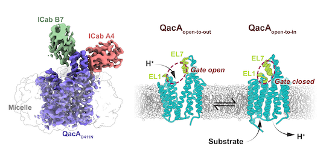

# QacA Efflux Pump: Structure, Function and Relevance

The QacA efflux pump is a membrane protein found predominantly in Staphylococcus aureus and is a member of the major facilitator superfamily (MFS) of transporters. Structurally, QacA is composed of 14 transmembrane helices and operates as a proton-coupled antiporter, utilizing the proton motive force to extrude a broad spectrum of monovalent and divalent cationic antimicrobial agents—including quaternary ammonium compounds, intercalating dyes, diamidines, and biguanidines—out of the bacterial cell.  The recent cryo-EM structure of QacA, resolved at 3.6 Å, reveals an outward-open conformation with a unique extracellular helical hairpin loop (EL7) between transmembrane helices 13 and 14, which is conserved in a subset of DHA2 transporters and plays a critical role in substrate efflux.

Functionally, QacA mediates resistance by exporting toxic compounds from the bacterial cytoplasm, thereby lowering their intracellular concentrations and protecting the cell from their effects. The pump’s substrate promiscuity is facilitated by multiple acidic residues in the vestibule, which enable the transport of structurally diverse cationic drugs through a competition-driven proton/substrate antiport cycle. The presence of the EL7 hairpin loop and its interaction with other extracellular loops are essential for the structural integrity and activity of QacA; removal or disruption of this motif significantly impairs efflux function. Importantly, QacA’s ability to extrude a wide variety of antimicrobial agents contributes to high-level multidrug resistance in clinical isolates of S. aureus. 

The clinical relevance of QacA lies in its contribution to the survival of S. aureus in environments with high concentrations of disinfectants and antiseptics, particularly in healthcare settings where quaternary ammonium compounds are frequently used. Inhibition of QacA and related efflux pumps has been shown to sensitize bacteria to antibacterial agents, suggesting that efflux pump inhibitors could be a promising strategy to combat multidrug resistance. Understanding the structure-function relationship of QacA, especially the role of conserved structural motifs like EL7, is crucial for the development of targeted inhibitors and for addressing the ongoing challenge of efflux-mediated resistance in pathogenic bacteria

## Sources: 

1. [CryoEM structure of QacA, an antibacterial efflux transporter from _Staphylococcus aureus_
](https://www.biorxiv.org/content/10.1101/2022.07.09.499445v1.full)
2. [Cryo‐EM structure of antibacterial efflux transporter QacA from _Staphylococcus aureus_ reveals a novel extracellular loop with allosteric role
](https://www.embopress.org/doi/full/10.15252/embj.2023113418)
3. [QacA multidrug efflux pump from _Staphylococcus aureus_: comparative analysis of resistance to diamidines, biguanidines, and guanylhydrazones
](https://pubmed.ncbi.nlm.nih.gov/9527814/)
4. [Efflux Pump (QacA, QacB, and QacC) and β-Lactamase Inhibitors? An Evaluation of 1,8-Naphthyridines against _Staphylococcus aureus_ Strains
](https://pubmed.ncbi.nlm.nih.gov/36838807/)

