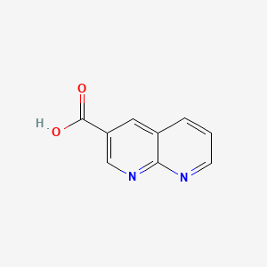
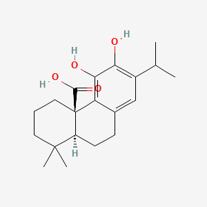
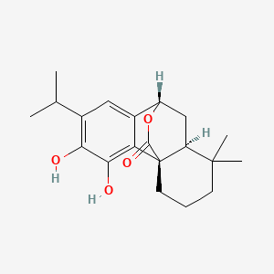

# Ligand Selection from Literature Review 

## Primary Ligands 

### 1,8-naphthyridine-3-carboxamide

1,8-naphthyridine-3-carboxamide is a synthetic compound of the 1,8-naphthyridine class that has been demonstrated to inhibit efflux pumps in Staphylococcus aureus, including QacA. Studies show that these compounds, when combined with antibiotics, significantly reduce the minimum inhibitory concentrations (MICs) of ethidium bromide and β-lactam antibiotics in QacA-expressing strains, indicating effective inhibition of pump and restoration of antibiotic susceptibility. 

### Carnosic Acid 
Carnosic acid is a phenolic diterpene derived from rosemary (Rosmarinus officinalis) that has been shown to act as an efflux pump inhibitor in S. aureus. Experimental evidence demonstrates that carnosic acid can dissipate membrane potential and inhibit the activity of efflux pumps, including QacA, thereby enhancing the intracellular accumulation of antimicrobial agents and reducing bacterial resistance.

### Carnosol 
Carnosol, another phenolic diterpene from rosemary, has been evaluated for its anti-efflux pump activity in multidrug-resistant S. aureus. In laboratory studies, carnosol significantly suppressed efflux pump activity in extensively drug-resistant S. aureus strains, as evidenced by reduced efflux in flow cytometry assays and potentiation of gentamicin activity, supporting its role as a QacA inhibitor.

### Compounds inhibiting QacA efflux activity in Staphylococcus aureus – Primary Ligands Summary

| **Compound Name**               | **PubChem CID** | **Description**                                                                                                                                                                                                                                                                                   |
| ------------------------------- | --------------- | -------------------------------------------------------------------------------------------------------------------------------------------------------------------------------------------------------------------------------------------------------------------------------------------------- |
| 1,8-Naphthyridine-3-carboxamide | 23435869        | This synthetic compound inhibits QacA efflux activity in *Staphylococcus aureus*, reducing resistance to antibiotics and ethidium bromide. Its use in combination with antibiotics has been shown to lower MICs in QacA-expressing strains, supporting its role as an efflux pump inhibitor.       |
| Carnosic acid                   | 65126           | Carnosic acid, a phenolic diterpene from rosemary, has demonstrated the ability to inhibit efflux pumps such as QacA by dissipating membrane potential. This action increases the intracellular concentration of antibiotics, thereby enhancing their effectiveness against resistant *S. aureus*. |
| Carnosol                        | 442009          | Carnosol, another diterpene from rosemary, has been shown to suppress QacA-mediated efflux in multidrug-resistant *S. aureus*. Laboratory studies report that carnosol potentiates antibiotic activity by reducing efflux pump function, as evidenced by flow cytometry assays.                    |
