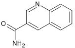

# Secondary Ligands: Quinoline-3-Carboxamide

<center>

</center>

SMILES: ```NC(=O)c1cnc2ccccc2c1```

| **Property**                  | **Value** | **Interpretation**                                    |
| ----------------------------- | --------- | ----------------------------------------------------- |
| Molecular Weight (MW)         | 371.78    |  Within acceptable range (< 500 Da)                  |
| LogP                          | 3.22      |  Acceptable lipophilicity (LogP < 5)                 |
| H-bond Donors (HBD)           | 2         |  Within range (≤ 5)                                  |
| H-bond Acceptors (HBA)        | 5         |  Within range (≤ 10)                                 |
| TPSA                          | 85.36 Ų  |  Optimal oral bioavailability (TPSA < 140 Ų)        |
| Rotatable Bonds               | 4         |  Low molecular flexibility (≤ 10)                    |
| Lipinski Rule Violations      | 0         |  Fully compliant                                     |
| Veber Rule                    | Passed    |  Good oral bioavailability potential                 |
| Bioavailability Score         | 0.55      |  Moderate probability of being orally bioavailable   |
| Synthetic Accessibility Score | 3.47      |  Fairly easy to synthesize (scale: 1 easy – 10 hard) |
| PAINS Filter                  | 0 alerts  |  No problematic substructures                        |
| Brenk Filter                  | 0 alerts  |  No structural liabilities                           |
| Lead-likeness                 | Yes       |  Could serve as a lead compound                      |
| Drug-likeness (QED)           | 0.78      |  High-quality compound (QED closer to 1 is better)   |

Quinoline-3-Carboxamide displays excellent drug-like characteristics. It complies fully with Lipinski's Rule of Five and Veber’s rule, suggesting a strong potential for oral bioavailability. With zero PAINS and Brenk alerts, the molecule lacks reactive or toxic substructures and is considered clean from a medicinal chemistry standpoint. Its QED score of 0.78 positions it as a high-quality candidate in the drug discovery pipeline. The compound also shows a good balance between lipophilicity (LogP 3.22) and solubility, alongside acceptable synthetic accessibility. Overall, this compound is a strong candidate for further optimization and biological screening.

> The compound is used for further screening based on docking. 